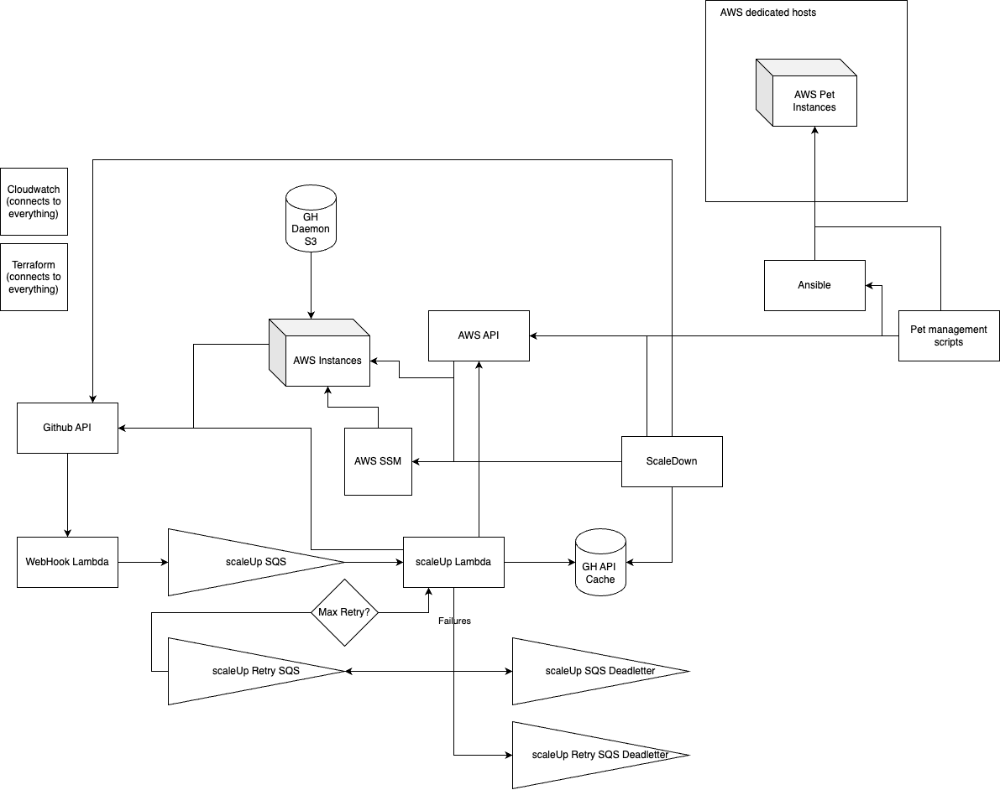

# Pytorch Terraform AWS Github Runner

This is a terraform module that sets up self hosted github runners on AWS along with the infra needed to autoscale them

# Directories

```
├── modules
|   ├── download-lambda
|   ├── runner-binaries-syncer # AWS Lambda func that
|   ├── runners                # AWS Lambda func that scales runners up and down based
|   |                          #   on SQS Events
|   ├── runners-instances      # Defines how instances hosting new runners will be configured
|   ├── setup-iam-permissions  # See Readme in the folder
|   └── webhook                # AWS Lambda func that receives Github
|                              #   webhooks and generates SQS events that
|                              #   trigger scale up requests
├── policies
├── templates
└── terraform_migrations

```

# Runner Architecture diagram
This diagram shows how the runners function once deployed to AWS

