# GPU Developer Servers Infrastructure

Terraform configuration for PyTorch GPU development servers using AWS EKS with Kubernetes pod scheduling.

## Quick Start

### 1. Testing Setup (Current Default)

```bash
# Deploy with 4x T4 instances for testing (default configuration)
terraform init
terraform plan
terraform apply
```

### 2. Production Setup (Future)

```bash
# Deploy with H100 instances for production
terraform plan -var="instance_type=p5.48xlarge" -var="gpu_instance_count=5"
terraform apply -var="instance_type=p5.48xlarge" -var="gpu_instance_count=5"
```

## Current Configuration

**Testing Environment:**

- **Instance Type**: `g4dn.12xlarge` (4x T4 GPUs per instance)
- **Node Count**: 2 instances
- **Total GPUs**: 8x T4 GPUs available
- **Cost**: ~$7.82/hour total for cluster

**Production Plan:**

- **Instance Type**: `p5.48xlarge` (8x H100 GPUs per instance)
- **Node Count**: 5 instances
- **Total GPUs**: 40x H100 GPUs available
- **Cost**: ~$490/hour total for cluster

## Configuration Options

### Customization Variables

```bash
# Override instance type
export TF_VAR_instance_type="g4dn.12xlarge"

# Override instance count
export TF_VAR_gpu_instance_count=2

# Override region
export TF_VAR_aws_region="us-east-2"
```

## Development - Connect to Kubernetes

To debug pods and services, configure kubectl to connect to your EKS cluster:

```bash
# Install kubectl (macOS)
brew install kubectl

# Configure kubectl for your EKS cluster
aws eks update-kubeconfig --region us-east-2 --name pytorch-gpu-dev-cluster

# Test connectivity
kubectl get nodes
kubectl get pods -n gpu-dev
kubectl get svc -n gpu-dev

# Debug a specific pod
kubectl logs <pod-name> -n gpu-dev
kubectl exec -it <pod-name> -n gpu-dev -- /bin/bash
```

## Architecture

### System Overview

```mermaid
---
title: GPU Developer Servers Architecture
---
flowchart TB
    CLI(("🖥️ GPU Dev CLI<br/>Python Tool")) --> |Reserve/Cancel| SQS{"📬 SQS Queue<br/>gpu-reservation-queue"}
    CLI --> |Query Status| DDB[("💾 DynamoDB<br/>Reservations Table")]

    SQS --> |Process Messages| LAMBDA1(["⚡ Reservation Processor<br/>Lambda Function"])
    SCHED(["⏰ CloudWatch Events<br/>Every 1 minute"]) --> |Queue Management| LAMBDA1

    LAMBDA1 --> |Update Status| DDB
    LAMBDA1 --> |Create/Delete Pods| EKS[["☸️ EKS Cluster<br/>GPU Nodes"]]
    LAMBDA1 --> |Query Capacity| EKS

    SCHED2(["⏰ CloudWatch Events<br/>Every 5 minutes"]) --> |Expiry Check| LAMBDA2(["⚡ Reservation Expiry<br/>Lambda Function"])
    LAMBDA2 --> |Check/Update| DDB
    LAMBDA2 --> |Cleanup Pods| EKS

    EKS --> |SSH Access| PODS(("🔧 GPU Dev Pods<br/>NodePort Services"))
    DEVS(("👩‍💻 Developers")) --> |SSH| PODS

    %% AWS Orange theme colors
    style CLI fill:#FF9900,stroke:#232F3E,stroke-width:2px,color:#fff
    style SQS fill:#FF9900,stroke:#232F3E,stroke-width:2px,color:#fff
    style DDB fill:#3F48CC,stroke:#232F3E,stroke-width:2px,color:#fff
    style LAMBDA1 fill:#FF9900,stroke:#232F3E,stroke-width:2px,color:#fff
    style LAMBDA2 fill:#FF9900,stroke:#232F3E,stroke-width:2px,color:#fff
    style EKS fill:#326CE5,stroke:#232F3E,stroke-width:2px,color:#fff
    style PODS fill:#326CE5,stroke:#232F3E,stroke-width:2px,color:#fff
    style SCHED fill:#87CEEB,stroke:#232F3E,stroke-width:2px,color:#000
    style SCHED2 fill:#87CEEB,stroke:#232F3E,stroke-width:2px,color:#000
    style DEVS fill:#28A745,stroke:#232F3E,stroke-width:2px,color:#fff
```



### Component Details

#### 1. **CLI Tool** (`gpu-dev-cli`)

- **Commands**: `reserve`, `list`, `cancel`, `connect`, `status`, `config`
- **Authentication**: AWS credentials + GitHub SSH keys
- **Configuration**: Zero-config approach with `~/.gpu-dev-config`

#### 2. **SQS Queue System**

- **Primary Queue**: `gpu-reservation-queue` - handles reservation and cancellation requests
- **Dead Letter Queue**: `gpu-reservation-dlq` - failed messages after 3 retries
- **Message Types**:
  - `reservation` (default) - create new reservation
  - `cancellation` - cancel existing reservation

#### 3. **Lambda Functions**

##### Reservation Processor (`reservation_processor`)

**Triggers**:

- SQS messages (real-time processing)
- CloudWatch Events (every 1 minute for queue management)

**Responsibilities**:

- Process reservation requests from SQS
- Create Kubernetes pods with GPU allocation
- Manage queue positions and ETA updates
- Handle cancellation requests
- Real-time GPU capacity tracking via K8s API

##### Reservation Expiry (`reservation_expiry`)

**Triggers**: CloudWatch Events (every 5 minutes)

**Responsibilities**:

- Check for expired reservations
- Send warning notifications (30min, 15min, 5min before expiry)
- Clean up expired pods and services
- Cancel stale queued reservations (>5min old)

#### 4. **DynamoDB Tables**

##### Reservations Table

**Primary Key**: `reservation_id`
**Indexes**:

- `StatusIndex` - Query by status (active, queued, pending, etc.)
- `UserIndex` - Query by user_id

**Schema**:

```json
{
  "reservation_id": "uuid-string",
  "user_id": "aws-username",
  "github_user": "github-username",
  "gpu_count": 1-16,
  "status": "pending|queued|preparing|active|expired|cancelled|failed",
  "created_at": "2025-01-12T10:30:00.000Z",
  "expires_at": "2025-01-12T18:30:00.000Z",
  "launched_at": "2025-01-12T10:35:00.000Z",
  "reservation_ended": "2025-01-12T18:30:00.000Z",
  "duration_hours": 8.0,
  "pod_name": "gpu-dev-abc12345",
  "namespace": "gpu-dev",
  "ssh_command": "ssh -p 31234 dev@1.2.3.4",
  "node_port": 31234,
  "node_ip": "1.2.3.4",
  "queue_position": 3,
  "estimated_wait_minutes": 45,
  "last_queue_update": "2025-01-12T10:31:00.000Z",
  "failure_reason": "error message",
  "cancelled_at": "2025-01-12T11:00:00.000Z"
}
```

**Analytics Fields:**

- `launched_at`: When the pod was successfully started (for wait time analysis: `launched_at - created_at`)
- `reservation_ended`: When the reservation ended (cancelled/expired) for usage analysis
- Early cancellation detection: `reservation_ended < expires_at`

#### 5. **EKS Cluster**

- **Node Groups**: GPU-enabled EC2 instances (g4dn.12xlarge for testing, p5.48xlarge for production)
- **Namespace**: `gpu-dev` - dedicated namespace for reservation pods
- **NVIDIA Device Plugin**: Exposes GPU resources to Kubernetes scheduler
- **Networking**: Full internet access, DNS resolution, NodePort services for SSH

#### 6. **Kubernetes Resources**

##### Pod Specification

- **Base Image**: `pytorch/pytorch:2.8.0-cuda12.9-cudnn9-devel`
- **GPU Allocation**: 1, 2, 4, 8, or 16 GPUs via `nvidia.com/gpu` resource requests
- **Init Container**: Sets up dev user and SSH keys from GitHub
- **Volumes**: `/home/dev` (user data), `/workspace` (shared storage, 100Gi)
- **Services**: NodePort service for SSH access (port range: 30000-32767)

### Message Flow

#### Reservation Creation

1. User runs `gpu-dev reserve --gpus 2 --hours 4`
2. CLI sends reservation message to SQS queue
3. CLI creates "pending" record in DynamoDB for immediate polling
4. CLI polls DynamoDB for status updates with real-time countdown
5. Reservation Processor Lambda triggered by SQS message
6. Lambda checks GPU availability via K8s API
7. If available: creates pod → status becomes "preparing" → "active"
8. If unavailable: status becomes "queued" with position and ETA

#### Queue Management (Every Minute)

1. CloudWatch triggers Reservation Processor Lambda
2. Lambda queries all "queued" and "pending" reservations
3. Lambda checks current GPU availability via K8s API
4. For each queued reservation:
   - If GPUs available: allocate and create pod
   - If not available: update queue position and ETA
5. ETAs calculated based on active reservation expiry times

#### Cancellation

1. User runs `gpu-dev cancel abc12345`
2. CLI sends cancellation message to SQS queue
3. Reservation Processor Lambda handles cancellation message
4. Lambda updates status to "cancelled" and cleans up pod if active

#### Expiry Management (Every 5 Minutes)

1. CloudWatch triggers Reservation Expiry Lambda
2. Lambda queries all "active" reservations
3. Sends warnings at 30min, 15min, 5min before expiry
4. Cleans up expired pods and updates status to "expired"
5. Cancels stale queued reservations (>5min old)

### GPU Resource Management

The system uses **Kubernetes-native GPU tracking** instead of manual allocation:

- **Real-time Capacity**: Queries K8s API for `nvidia.com/gpu` resources
- **Automatic Allocation**: K8s scheduler handles GPU assignment to pods
- **No State Drift**: GPU availability always reflects actual cluster state
- **Fault Tolerance**: Pod failures automatically free GPU resources

### Deployment Configuration

#### Testing Environment (Current)

- **2x g4dn.12xlarge** instances (4 GPUs each = 8 total)
- **Cost**: ~$7.82/hour
- **Region**: us-east-2

#### Production Environment (Planned)

- **5x p5.48xlarge** instances (8 H100 GPUs each = 40 total)
- **Cost**: ~$490/hour
- **Single AZ**: Placement groups for EFA networking

## CLI Usage

Once deployed, use the CLI to make reservations:

```bash
# Configure your GitHub username for SSH access
gpu-dev config set github_user your-github-username

# Reserve GPUs
gpu-dev reserve --gpus 2 --hours 4

# List your reservations
gpu-dev list
```
