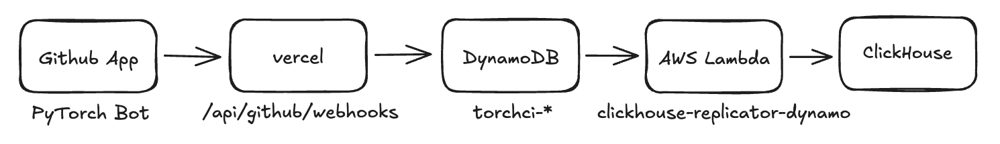

# `torchci` architecture notes

## Primary write path

How does data get from GitHub to `torchci`?

Whenever something happens on GitHub, a [webhook event] is created and sent to
all subscribers. The [webhook payload] will contain all the necessary
information about the event. For example, if a new issue is created, an
[`issues`] webhook is generated, providing information about the issue title,
who created the issue, etc.

[GitHub Apps] can subscribe to webhooks for the repos that they're installed
on. `torchci` uses the [PyTorch Bot] app to keep track of what's going on in
`pytorch/pytorch` and any other repos it's installed on.

These webhooks are delivered to an API endpoint on [hud.pytorch.org]
([`/api/github/webhooks`]), which writes the webhook payload to a DynamoDB
table corresponding to the event type. For example, `workflow_job` payloads are
written to `torchci-workflow-job`.

Rockset is [integrated][dynamo] with DynamoDB and automatically picks up any
changes in the tables in its collections.

[webhook event]: https://docs.github.com/en/developers/webhooks-and-events/webhooks/about-webhooks
[webhook payload]: https://docs.github.com/en/developers/webhooks-and-events/webhooks/webhook-events-and-payloads
[`issues`]: https://docs.github.com/en/developers/webhooks-and-events/webhooks/webhook-events-and-payloads#issues
[github apps]: https://docs.github.com/en/developers/apps/getting-started-with-apps/about-apps
[pytorch bot]: https://github.com/apps/pytorch-bot
[`/api/github/webhooks`]: https://github.com/pytorch/test-infra/blob/main/torchci/pages/api/github/webhooks.ts
[dynamo]: https://rockset.com/docs/amazon-dynamodb/

## Secondary write paths

There are some parts to the system that don't use the write path described
above, because GitHub doesn't generate webhooks for them.

Notably, this means that **installing the PyTorch Bot app to repos will not
enable these write paths**. They must be manually wired up.

### Build artifacts

Our build jobs create various artifacts that we want to save to persistent
storage and use later. For example, most of our build jobs produce binary wheel
distributions of PyTorch that are later downloaded by our test jobs.

These are uploaded to S3 directly by the GitHub workflows in `pytorch/pytorch`.

### Logs and log classifications

Logs are downloaded by the [`github-status-test`] AWS lambda, which receives
webhooks through a manual connection with the `pytorch/pytorch` repo.
`github-status-test` then pings another lambda, [`log-classifier`], which
performs log classification (more detail in the [README]).

[readme]: https://github.com/pytorch/test-infra/blob/main/aws/lambda/log-classifier/README.md

The logic in `github-status-test` could be moved to the `hud.pytorch.org`
webhooks endpoint, and modified so that all repos that `torchci` is installed
on benefits from log downloads and classifications, but this is not currently
implemented. Add @suo as a reviewer on a PR if you want to add it!

### Test statistics

See the [README](https://github.com/pytorch/pytorch/tree/master/tools/stats).

### CircleCI results

CircleCI also has webhooks like GitHub, but they must be configured manually.
The webhooks are delivered to the [`ossci-circleci-to-s3`] lambda, which is
synced to Rockset. See the [example config] for `pytorch/vision` webhooks for
an example.

[`ossci-circleci-to-s3`]: https://us-east-1.console.aws.amazon.com/lambda/home?region=us-east-1#/functions/ossci-circleci-to-s3?tab=code
[example config]: https://app.circleci.com/settings/project/github/pytorch/vision/webhooks/a5ae92ec-d523-4495-be2a-58ab80a255b9?return-to=https%3A%2F%2Fapp.circleci.com%2Fpipelines%2Fgithub%2Fpytorch%2Fvision

### Raw webhook payloads

For archival purposes, we save all raw webhook payloads to S3. This is done
through the [`github-status-test`] lambda (the same one that downloads logs).
The raw webhook payloads are uploaded to the [`ossci-raw-job-status`] S3 bucket.

[`github-status-test`]: https://us-east-1.console.aws.amazon.com/lambda/home?region=us-east-1#/functions/github-status-test?tab=code
[`ossci-raw-job-status`]: https://s3.console.aws.amazon.com/s3/buckets/ossci-raw-job-status?region=us-east-1&tab=overview

## Adding a new repo to `torchci`

To get the basic HUD working, you will need to:

1. Install the PyTorch Bot app to the repo. This requires admin access to the
   `pytorch` org. To find someone with admin access, consult the [Build/CI POCs].
2. Configure CircleCI to send webhooks to `torchci` (see above). This requires
   admin access to CircleCI. (**NOTE**: Only required if running CircleCI workflows)

You won't get any of the other goodies listed in "Secondary write paths" above,
but other than that, things should work!

[build/ci pocs]: https://pytorch.org/docs/master/community/persons_of_interest.html#build-ci
